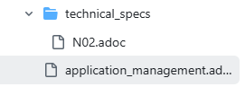
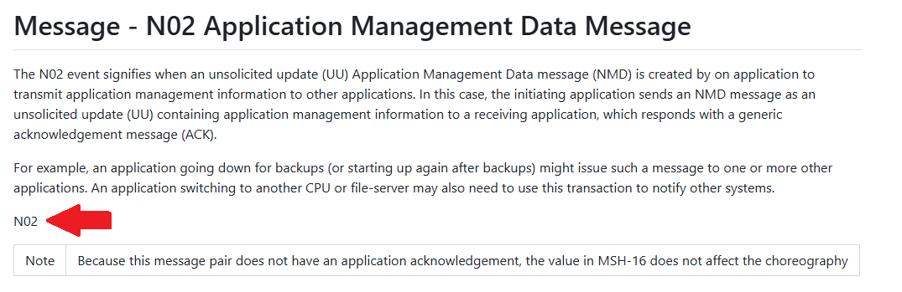
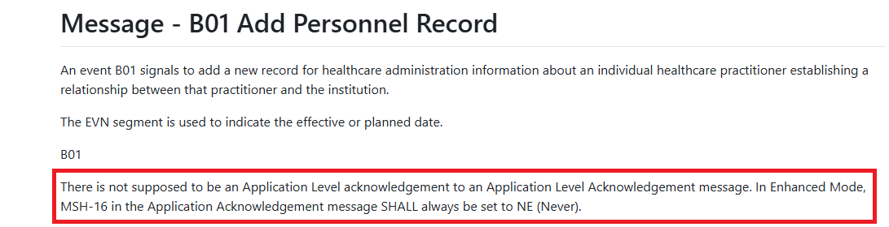
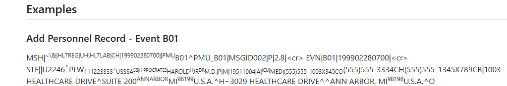

= Tips and Tricks for Editors (by editors)

* Where "chapter" is used, "domain" is an acceptable substitution (e.g. "The information in this chapter was relocated from Appendix C as of v2.4")
** One exception is where the text references content elsewhere (e.g. "repetition of segments is described in Chapter 2, section 2.12, 'Chapter Formats for Defining HL7 Messages.'"). These references will be cleaned up programatically later and should be left as is
* When reviewing a section, be sure to review both the domain level .adoc file as well as the narrative in all .sdoc files in the technical_specs folder in Github

* When reviewing an .adoc file in the technical_specs folder, there may be an event value (e.g. A01) in the text that equates to "[tabset] A01" in the editable view of the content. This is a place holder for the set of tab holding the message structure and choreography tabs. Leave these as they are

* In some technical_spec .adoc files there is relatively generic text (often related to acknowledgement messages. If this text is not helpful in its existing location and is relatively generic, it can be removed.

* Example messages are contained within an [er7] block. Michael will apply special formatting to the examples, but the GitHub preview does not. Therefore they look ugly (segments run together, seemingly random bits are superscripted, etc). Just leave them as they are.

