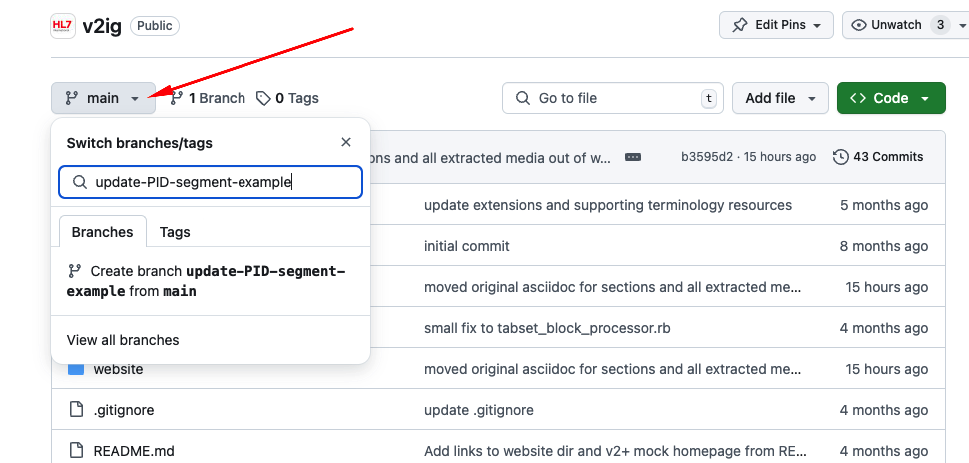

= Using Git Branches While Editing v2+

Ideally, a separate branch should be created for each set of changes that are logically related.  Ideally, any changes that are related to any given Jira ticket will all be made in a single branch.
In this case, _only_ changes related to the Jira ticket should be made in the branch.  It may be the case, particularly during the early stages of v2+ development, that changes will be made
that are not specified by any Jira ticket.  In this case, it is still highly recommended that all changes in any given branch be limited to only those that are logically related to each other.

We are working towards an automated build process similar to that used by https://build.fhir.org/branches/[FHIR] and by the https://build.fhir.org/ig/HL7/UTG/branches/[UTG] project 
where individual branches will be built and deployed to the web so that the changes may be viewed in the context of the rendered v2+ specification.

== Creating a Branch

In order to create a branch, visit the main https://github.com/HL7/v2ig[v2ig] page.

From this page, click the branch button as shown in the image below.

