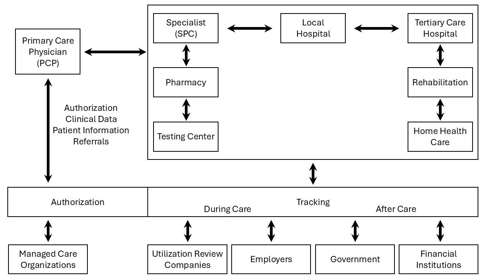

= Referral

== Introduction
[v291_section="11.2"]

The Patient Referral topic defines the message set used in patient referral (GLOSSARY) communications between mutually exclusive healthcare entities. These referral transactions frequently occur between entities with different methods and systems of capturing and storing data. Such transactions frequently traverse a path connecting primary care providers (GLOSSARY), specialists (GLOSSARY), payors (GLOSSARY), government agencies, hospitals, labs, and other healthcare entities. The availability, completeness, and currency of information for a given patient will vary greatly across such a spectrum.

The referral in this specification is viewed from the perspective of the provider as an individual, irrespective of his/her affiliation with a specific institution or campus. Events triggering this kind of message are not restricted to a hospital environment, but have a community-wide area of impact in which more extensive identification of patients and healthcare providers (GLOSSARY) is needed. Therefore, a referral must contain adequate identification information to meet the broadly varying requirements of the dissimilar systems within the community.

This topic describes the various events and resulting transactions that make up the referral message set. Examples have been provided to demonstrate the use of this specification within the events described. Each event example centers on a primary care provider's encounter (GLOSSARY) with a patient.

== General Use Cases / Background

=== Patient Referral and Responses
[v291_section="11.2.1"]

When a patient is referred by one healthcare entity AKA Referring Provider (GLOSSARY) (e.g., a primary care provider) to another AKA Referred-to-Provider (GLOSSARY) (e.g., a specialist or lab) or when a patient inquiry is made between two separate entities, little is known about the information each party requires to identify or codify the patient. The receiving entity may have no knowledge of the patient and may require a full set of demographics, subscriber (GLOSSARY) and billing information, eligibility/coverage information, pre-authorization information, and/or clinical data to process the referral. If the receiving entity already has a record of the patient, the precise requirements for identifying that patient record will vary greatly from one entity to another. The existing record of a patient residing in the database of a specialist, a lab, or a hospital may require updating with more current information. In addition, providers receiving a referral often require detailed information about the provider making the referral, such as a physician's name and address.

For example, a primary care provider making a referral may need to obtain insurance information or pre-authorization (GLOSSARY) from a payor prior to making a referral. Getting this information requires an inquiry and a response between the primary care provider and the payor. In addition, the primary care provider may request results from a lab to accompany the referral. Getting these results may require an inquiry and a response between the primary care provider and the lab. The information could then be incorporated into a referral sent from the primary care provider to the specialist. As the referral is processed, requested procedures are performed, the results are observed, and the relevant data must be returned to the primary care provider. Such a response may frequently take the form of multiple responses as results become available.

The message set that encompasses these transactions includes the referral (REF), requests for information (RQA, RQC, RQP, RQI) and the returned patient information (RCI, RCL, RPA, RPI, RPL, RRI). The referral message originates a transaction and a return patient information message concludes the transaction. At least one RPA/RPI is required to complete a patient referral or a patient request transaction, although multiple RPI messages may be returned in response to a single REF message. The segments used in the REF, RQA, RQI, RQP, RRI, RPH, RCI, RCL, RPA and RPI messages encompass information about patient, guarantor (GLOSSARY) and next of kin demographics, eligibility/coverage (GLOSSARY) information, accident, diagnosis, requested procedures, payor pre-authorization, notes, and referring and consulting provider data.

==== Patient referral
[v291_section="11.2.1.1"]

There are clear distinctions between a referral and an order. An order is almost always an intra-enterprise transaction and represents a request from a patient's active provider to supporting providers for clearly defined services and/or results. While the supporting provider may exercise great discretion in the performance of an order, overall responsibility for the patient's plan of treatment remains with the ordering provider. As such, the ordering provider retains significant control authority for the order and can, after the fact, cause the order to be canceled, reinstated, etc. Additionally, detailed results produced by the supporting provider are always reported back to the ordering provider, who remains ultimately responsible for evaluating their value and relevance. A referral, on the other hand, can be either an intra- or an inter-enterprise transaction and represents not only a request for additional provider support but also a transfer of a portion or all of the responsibility for the patient's plan of treatment. Once the referral is made, the referring provider, during the transfer period, retains almost no control of any resulting actions. The referred-to provider becomes responsible for placing any additional orders and for evaluating the value and relevance of any results, which may or may not be automatically passed back to the referring provider. A referred-to provider may, in turn, also become a referring provider.

A referral message is used to support transactions related to the referral of a patient from one healthcare provider to another. This kind of message will be particularly useful from the perspective of a primary care provider referring a patient to a specialist. However, the application of the message should not be limited to this model. For example, a referral may be as simple as a physician sending a patient to another physician for a consultation or it may be as complex as a primary care provider sending a patient to a specialist for specific medical procedures to be performed and attaching the payor authorizations for those requested procedures as well as the relevant clinical information on the patient's case.

In a community model, stringent security requirements will need to be met when dealing with the release of clinical information. This message set facilitates the proper qualification of requests because the message packet will contain all the data required by any application in the community, including the necessary patient demographic information and the proper identification of the party requesting the information.

==== Responding to a patient referral
[v291_section="11.2.1.2"]

When a patient is referred by one provider to another or is pre-admitted, there is a great likelihood that subsequent transactions will take place between the initiating entity (the referring or admitting physician) and the responding entity (the specialist or hospital). The subsequent transactions might include a variety of queries, orders, etc. Within those subsequent transactions, there must be a way for the initiating system to refer to the patient. The "generic" patient information included in the original referral or the pre-admit Patient Identification (PID) segment may not be detailed enough to locate the patient in the responding facility's database, unless the responding facility has assigned a unique identifier to the new patient. Similarly, the responding system may not have record retrieval capabilities based on any of the unambiguous, facility-neutral data elements included in the original referral or pre-admit PID segment. This problem could result in the responding system associating subsequent orders or requests with the wrong patient. One solution to this potential problem is for the responding system to utilize the RRI message and return to the initiating system the unique internal identifier it assigns to the patient, and with which it will primarily (or even exclusively) refer to that patient in all subsequent update operations. However, the intent of the RRI message is that it will supply the originator of the referral type message with sufficient patient demographic and/or clinical information (GLOSSARY) to properly process continued transactions.

==== Communicating Collaborative Care of a Patient
[v291_section="11.2.1.3"]

When providers collaborate in the sharing of patient care there can be many types of communications involved, and the expectations, roles and responsibilities may not always be clear and explicit; they may vary in different jurisdictions or work practice environments.

FIX ME (OR AT LEAST REVIEW ME) The use of HL7 Version 2 in clinical messaging has involved the use of segments in ways for which they were not originally intended, as well as the development of the REL segment to express important relationships between clinical data components. Such use has also necessitated the introduction of mood codes to allow for the richer representation of intent, purpose, timing, and other event contingencies that such concepts required. When these extensions are applied to segments in messages which predate them there is the risk that a message generated by a system compliant with an earlier release could be misinterpreted by a system which interprets the segments in the wider context. The approach to this has been to constrain the use of the enhancements to these segments to new messages, or to newer versions of existing messages. The REF message has been in releases which pre-date the v2.6 clinical enhancements and its limitations in this regard, together with the need for a range of new Collaborative Care interactions, have led to the need for the Collaborative Care Message. Being developed to use the clinical v2.6 enhancements from the outset, the collaborative care messages do not need these versioning constraints around their use.

=== Application Roles and Data Process
[v291_section="11.2.2"]

==== Application roles
[v291_section="11.2.2.1"]

This Standard assumes that there are four roles that an application can take on: a referring or referred-by provider application role, a referred-to provider application role, a querying application role, and an auxiliary application role. These application roles define the interactions an application will have with other applications in the messaging environment. In many environments, any single application may take on more than one application role.

This Standard's definition of application roles does not intend to define or limit the functionality of specific products developed by vendors of such applications. Instead, this information is provided to help define the model used to develop this Standard, and to provide an unambiguous way for applications to communicate with each other.

==== The referring provider application role
[v291_section="11.2.2.2"]

A referring provider application requests the services of another healthcare provider (a referred-to provider) application. There may or may not be any association between the referring provider application and the receiving entity. Although in most cases a referral environment will be inter-enterprise in nature, it is not limited to that model and applies to intra-enterprise situations also. Because the referring provider application cannot exert any control over the referred-to provider application, it must send requests to modify the status of the referred-to provider application. The referring provider application will often assume an auxiliary application role once a patient has been accepted by another application. Once this happens, the referring provider application may receive unsolicited status updates from the referred-to provider application concerning the care of a patient.

The analog of a referring provider application in a non‑automated environment might be a primary care provider diagnosing a patient with a problem that must in turn be referred to a specialist for a service. The primary care provider would contact the specialist and refer the patient into his care. Often, the specialist may not receive the patient into his care, preferring instead to refer the patient to another healthcare provider. The referring provider will indicate the diagnosis and any requested services, and the specialist to whom the patient is referred will indicate whether the referral will be accepted as specified. Once a patient referral has been accepted by the specialist, the specialist may send out updates to the primary care provider concerning the status of the patient as regards any tests performed, their outcomes, etc.

==== The referred-to provider application role
[v291_section="11.2.2.3"]

A referred-to provider application, in the referral model, is one that performs one or more services requested by another healthcare provider (referring provider). In other words, a referred-to provider application exerts control over a certain set of services and defines the availability of those services. Because of this control, no other application has the ability to accept, reject, or otherwise modify a referral accepted by a particular referred-to provider application.

Other applications can, on the other hand, make requests to modify the status of an accepted referral "owned by" the referred-to provider application. The referred-to provider application either grants or denies requests for information, or otherwise modifies the referrals for the services over which it exerts control.

Finally, the referred-to provider application also provides information about the referral encounter to other applications. The reasons that an application may be interested in receiving such information are varied. An application may have previously requested the status of the referral encounter, or it may simply be interested in the information for its own clinical reporting or statistical purposes. There are two methods whereby the referred-to provider applications disseminate this information: by issuing unsolicited information messages to auxiliary applications, or by responding to queries made by querying applications.

The analog of a referred-to provider application in a non‑automated environment might be a specialist such as a cardiologist. A patient does not generally go to a cardiologist for routine health care. Instead, a patient generally goes to a primary care provider, who may diagnose the patient with a heart ailment and refer that patient to a cardiologist. The cardiologist would review the information provided with the referral request and determine whether or not to accept the patient into his care. Once the cardiologist accepts the patient, anyone needing information on the status of the patient must then make requests to the cardiologist. In addition, the cardiologist may forward unsolicited information regarding the treatment of the patient back to the primary care provider. Once the cardiologist accepts the referred patient, he/she may determine that additional information regarding the patient is needed. It will often take the role of a querying application by sending a query message to the patient's primary care provider and requesting additional information on demographics, insurance information, laboratory test results, etc.

==== The querying application role
[v291_section="11.2.2.4"]

A querying application neither exerts control over, nor requests changes to a referral. Rather than accepting unsolicited information about referrals, as does an auxiliary application, the querying application actively solicits this information using a query mechanism. It will, in general, be driven by an entity seeking information about a referral such as a referring provider application or an entity seeking information about a referred patient such as a referred-to provider application. The information that the querying application receives is valid only at the exact time that the query results are generated by the provider applications. Changes made to the referral or the referred patient's status after the query results have been returned are not communicated to the querying application until it issues another query transaction.

The analog of a querying application in a non‑automated environment might be a primary care provider seeking information about a specific patient who has been referred to a specialist. For example, a patient may have been referred to a specialist in order that a specific test be performed, following which, the patient would return to the primary care provider. If the specialist has not forwarded information regarding the testing procedures for the patient to the primary care provider, the primary care provider would then query the specialist for the outcome of those procedures. Likewise, if a specialist received a referred patient without the preliminary diagnoses of test results, they might in turn query the primary care provider for the information leading to the diagnoses and subsequent referral.

==== The auxiliary application role
[v291_section="11.2.2.5"]

Like querying applications, an auxiliary application neither exerts control over nor requests changes to a referral or a referred patient. They, too, are only concerned with gathering information about a particular referral. An auxiliary application is considered an "interested third‑party," in that it is interested in any changes to a particular referral or referred patient, but has no interest in changing it or controlling it in any way. An auxiliary application passively collects information by receiving unsolicited updates from a provider application.

The analog of an auxiliary application in a non‑automated environment might be any person receiving reports containing referral information. For example, an insurance company may need information about the activities a patient experiences during specific referral encounters. Primary care providers may need to forward information regarding all referred patients to a payor organization.

In turn, a primary care provider may have the ability to track electronically a patient's medical record. The provider would then be very interested in receiving any information regarding a patient referred to a specialist.

==== Application roles in a messaging environment
[v291_section="11.2.2.6"]

In a messaging environment, these application roles communicate using specific kinds of messages and trigger events. The following figure illustrates the relationships between actors in a messaging environment:

Figure 1. Application role messaging relationships

== Technical Specs

=== Patient Information Request Messages

Patient information may need to be retrieved from various enterprises. The definition of these enterprises often varies greatly. Some enterprises may be providers or reference laboratories, while others may be payors providing insurance information. In the first case, the message definitions will focus on patient and provider information, while in the latter case, the message definition will deal primarily with patient and subscriber identification.

xref:technical_specs/I01.adoc[Message - I01 Request for Insurance]

xref:technical_specs/I02.adoc[Message - I02 Request of Patient Selection Display List]

xref:technical_specs/I03.adoc[Message - I03 Request of Patient Selection List]

xref:technical_specs/I04.adoc[Message - I04 Request for Demographics]

xref:technical_specs/I07.adoc[Message - I07 Unsolicited Insurance Information]

=== Patient Treatment Authorization Requests

This functional definition applies to a request for treatment authorization. Although this message also pertains to the payor, it differs greatly from that of an insurance information request. This message is used to request an authorization for specific procedures. Just as patient identification was important in an insurance information request, the focus of this functional area is provider identification, requested treatments/procedures and, in many cases, clinical information on a patient needed to fulfill review or certification requirements.

xref:technical_specs/I08.adoc[Message - I08 Request for Treatment Authorization Information]

xref:technical_specs/I09.adoc[Message - I09 Request for Modification to an Authorization]

xref:technical_specs/I10.adoc[Message - I10 Request for Resubmission of an Authorization]

xref:technical_specs/I11.adoc[Message - I11 Request for Cancellation of an Authorization]

=== Patient Referral Messages

These message definitions and event codes define the patient referral. Although only three trigger events are defined, the abstract message is very versatile and can provide for a wide variety of inter-enterprise transactions.

xref:technical_specs/I12.adoc[Message - I12 Patient Referral]

xref:technical_specs/I13.adoc[Message - I13 Modify Patient Referral]

xref:technical_specs/I14.adoc[Message - I14 Cancel Patient Referral]

xref:technical_specs/I15.adoc[Message - I15 Request Patient Referral Status]

=== Collaborative Care Messages

These message definitions and event codes define the collaborative care exchanges, including patient referral, discharge summary and infectious diseases notifications. Although only seven trigger events are defined, the abstract message is very versatile and can provide for a wide variety of exchanges of information between care entities.

xref:technical_specs/I21.adoc[Message - I21 Collaborative Care Message]

xref:technical_specs/I16.adoc[Message - I16 Collaborative Care Referral]

xref:technical_specs/I17.adoc[Message - I17 Modify Collaborative Care Referral]

xref:technical_specs/I18.adoc[Message - I18 Cancel Collaborative Care Referral]

xref:technical_specs/I20.adoc[Message - I20 Asynchronous Collaborative Care Update]

=== Collaborative Care Information Request Messages

Collaborative care information may need to be retrieved from various entities, such as healthcare providers, clinical repositories or regulatory bodies. The definition of these entities often varies greatly. Some times the query will relate to a previous referral. At other times it will relate to a specific patient.

xref:technical_specs/I19.adoc[Message - I19 Collaborative Care Query/Collaborative Care Query Update]

xref:technical_specs/I22.adoc[Message - I22 Collaborative Care Fetch / Collaborative Care Information]

== Example Transactions
[v291_section="11.9"]

The following examples will demonstrate the proposed way in which the RQI, RQA and REF messages can be used with the I01 (request for insurance information), I08 (request for treatment authorization information), I15 (request patient referral status) and I06 (request/receipt of clinical data listing) event codes. The events are presented in the order in which they would occur in a typical patient encounter. The first event to occur when the patient visits the medical practice is the verification of eligibility/coverage information. Next, the patient will be diagnosed and may be referred to a specialist for further treatment. This procedure may require a request for pre-authorization from the payor, which will be forwarded to the referral provider. Once the referral provider begins treatment, messages regarding the status or outcome of the treatment will be sent to the referring provider. Queries may also be sent to the specialist and reference laboratories.

=== RQI Message Using an I01 Event with an Immediate Response
[v291_section="11.9.1"]

When a patient arrives for an appointment, the office staff will frequently need to verify the patient's insurance information. In the following RQI message example, Dr. Hippocrates is sending an insurance information request to the H. C. Payor Insurance Company for his patient, Adam A. Everyman. The response from the payor is shown in a more complete IN1 segment. However, it should be noted that in addition to the IN1 segment, this return information could have been placed in the NTE segment to serve as display data. This strategy would serve a broader community of diverse application systems that might have different levels of ability to process the record-formatted data.

[er7]
MSH|^~\&|HIPPOCRATESMD|EWHIN|MSC|EWHIN|20250107155043||RQI^I01|HIPPOCRATESMD7888|P|2.9|||NE|AL
PRD|RP|HIPPOCRATES^HAROLD^^^DR^MD|1001 HEALTHCARE^DRIVE^ANN ARBOR^MI^99999| ^^^HIPPOCRATESMD&EWHIN^^^^^HIPPOCRATES MEDICAL CENTER|HIPPOCRATESMD7899
PRD|RT|HCIC||^^^MSC&EWHIN^^^^^H.C. PAYOR INSURANCE COMPANY
PID||| HL71001111111111^9^M10||EVERYMAN^ADAM^A||19800309||||||||||||444-33-3333
IN1|1|PPO|HC02|HCIC (MI State Code)|

[er7]
MSH|^~\&|MSC|EWHIN|HIPPOCRATESMD|EWHIN|20250107155212||RPI^I01|MSC2112|P|2.9|||ER|ER
MSA|AA|HIPPOCRATESMD7888|ELIGIBILITY INFORMATION FOUND
PRD|RP|HIPPOCRATES^HAROLD^^^DR^MD|1001 HEALTHCARE DRIVE^^ANN ARBOR^MI^99999| ^^^HIPPOCRATESMD&EWHIN^^^^^HIPPOCRATES MEDICAL CENTER|HIPPOCRATESMD7899
PRD|RT|HCIC||^^^MSC&EWHIN^^^^^H.C. PAYOR INSURANCE COMPANY
PID|||HL71001111111111^9^M10||EVERYMAN^ADAM^A||19800301||||||||||||444-33-3333
IN1|1|PPO|HC02|HCIC (MI State Code)|5555 INSURERS CIRCLE ^^ANN ARBOR^MI^99999^USA|CHRISTOPHER CLERK|(855)555-1234|987654321||||20221101||||EVERYMAN^ADAM^A|1|19800309|N. 2222 HOME STREET^^ANN ARBOR^MI^99999^USA|||||||||||||||||444333555||||||01|M<cr>

=== RQA Message Using an I08 Event with an Immediate Response
[v291_section="11.9.2"]

When the attending physician decides to refer the patient for treatment to another healthcare provider, pre-authorization may be required by the payor. In the following RQA example, Dr. Blake is requesting the appropriate pre-authorization from H.C Payor Insurance Company for a colonoscopy on Adam Everyman. The request includes the diagnosis, in case it is a factor in the approval decision. As shown below, the immediate response indicates approval of the request that was made on 01/10/2025 and that expires on 05/10/2025. In actuality, most payors require some human intervention in the pre-authorization process and would probably not respond immediately.

[er7]
MSH|^~\&|HIPPOCRATESMD|EWHIN|MSC|EWHIN|20250110105307||RQA^I08|HIPPOCRATESMD7898|P|2.9|||NE|AL
PRD|RP|HIPPOCRATES^HAROLD^^^DR^MD|1001 HEALTHCARE DRIVE^^ANN ARBOR^MI^99999| ^^^HIPPOCRATESMD&EWHIN^^^^^HIPPOCRATES MEDICAL CENTER|HIPPOCRATESMD7899
PRD|RT|HIIC||^^^MSC&EWHIN^^^^^H.C.PAYOR INSURANCE COMPANY
PID|||HL71001111111111^9^M10||EVERYMAN^ADAM^A||19800309||||||||||||444-33-3333
IN1|1|PPO|HC02|HCIC (MI State Code)|5555 INSURERS CIRCLE^^ANN ARBOR^MI^99999^USA|CHRISTOPHER CLERK|(855)555‑1234|(555)555-3002||||19901101||||EVERYMAN^ADAM^A|1|19800309|2222 HOME STREET^^ANN ARBOR^MI^99999^USA|||||||||||||||||444333555||||||01|M
DG1|1|I9|569.0|RECTAL POLYP|20250106103500|0
PR1|1|C4|45378|Colonoscopy|20250110105309|00

[er7]
MSH|^~\&|MSC|EWHIN|HIPPOCRATESMD|EWHIN|20250110154812||RPA^I08|MSC2112|P|2.9|||ER|ER
MSA|AA|HIPPOCRATESMD7888
PRD|RP|HIPPOCRATES^HAROLD^^^DR^MD|1001 HEALTHCARE DRIVE^^ANN ARBOR^MI^99999| ^^^ HIPPOCRATESMD &EWHIN^^^^^HIPPOCRATES MEDICAL CENTER| HIPPOCRATESMD7899
PRD|RT|HIIC||^^^MSC&EWHIN^^^^^H.C.PAYOR INSURANCE COMPANY
PID|||HL71001111111111^9^M10||EVERYMAN^ADAM^A||19800301|||||||||||| HL71001111111111
IN1|1|PPO|HC02|HCIC (MI State Code)|5555 INSURERS CIRCLE^^ANN ARBOR^MI^99999^USA|CHRISTOPHER CLERK|(855)555‑1234|(555)555-3002||||19901101||||EVERYMAN^ADAM^A|1|19800309|2222 HOME STREET^^ANN ARBOR^MI^99999^USA|||||||||||||||||444555333||||||01|M
DG1|1|I9|569.0|RECTAL POLYP|20250106103500|0
PR1|1|C4|45378|Colonoscopy|20250110105309|00
AUT|PPO|HC02|HIIC (MI State Code)|20250110|20250510|HL71001111111111|175|1<cr>

=== RQA Message Using an I08 Event with a Deferred Response
[v291_section="11.9.3"]

In the following example of a pre-authorization request, the payor indicates his receipt of the request (a standard acknowledgment message), but defers issuing a pre-authorization to a later time. This response represents a more typical payor transaction sequence. Note the use of the "Accept Acknowledgment Type," requiring the receiving system to respond in all cases to receipt of the message.

[er7]
MSH|^~\&|HIPPOCRATESMD|EWHIN|MSC|EWHIN|20250110105307||RQA^I08|HIPPOCRATES7898|P|2.9|||AL|AL
PRD|RP| HIPPOCRATES^HAROLD ^^^DR^MD|1001 HEALTHCARE DRIVE^^ANN ARBOR^MI^99999| ^^^HIPOOCRATES&EWHIN^^^^^HIPPOCRATES MEDICAL CENTER|HIPPOCRATESM7899
PRD|RT|HIIC||^^^MSC&EWHIN^^^^^H.C.PAYOR INSURANCE COMPANY
PID||| HL71001111111111^9^M10||EVERYMAN^ADAM^A||19800301|||||||||||| HL71001111111111
IN1|1|PPO|HC02|HCIC (MI State Code)|5555 INSURERS CIRCLE^^ANN ARBOR^MI^99999^USA|CHRISTOPHER CLERK|(855)555‑1234|(555)555-3002||||19901101||||EVERYMAN^ADAM^A|1|19800309|2222 HOME STREET^^ANN ARBOR^MI^99999^USA|||||||||||||||||444555333||||||01|M
PR1|1|C4|45378|Colonoscopy|20250110105309|00

[er7]
MSH|^~\&|MSC|EWHIN|HIPPOCRATESMD|EWHIN|2025011015315||MCF|MSC2112|P|2.9|||ER|ER
MSA|AA|HIPPOCRATES7888
MSH|^~\&|MSC|EWHIN|HIPPOCRATESMD|EWHIN|20250111102304||RPA^I08|MSC2113|P|2.9|||ER|ER
MSA|AA|HIPPOCRATESM7888
PRD|RP| HIPPOCRATES^HAROLD ^^^DR^MD|1001 HEALTHCARE DRIVE^^ANN ARBOR^MI^99999| ^^^HIPOOCRATES&EWHIN^^^^^HIPPOCRATES MEDICAL CENTER|HIPPOCRATESM7899+
PRD|RT|WSIC||^^^MSC&EWHIN^^^^^H.C.PAYOR INSURANCE COMPANY
PID|||HL71001111111111^9^M10||EVERYMAN^ADAM^A||19800301|||||||||||| HL71001111111111
IN1|1|PPO|HC02|HCIC (MI State Code)|5555 INSURERS CIRCLE^^ANN ARBOR^MI^99999^USA|CHRISTOPHER CLERK|(855)555‑1234|(555)555-3002||||19901101||||EVERYMAN^ADAM^A|1|19800309|2222 HOME STREET^^ANN ARBOR^MI^99999^USA|||||||||||||||||444555333||||||01|M
PR1|1|C4|45378|Colonoscopy|20250110105309|00
AUT|PPO|HC02|HIIC (MI State Code)|20250110|20250510|HL71001111111111|175|1<cr>

=== REF Message Using an I11 Event with an Immediate Response
[v291_section="11.9.4"]

Once pre-authorization has been received, the patient is referred to the referral provider. In the following example, Dr. Hippocrates is referring Adam Everyman to Dr. Tony Tum for a colonoscopy. The referral message includes the patient's demographic information, diagnosis and the pre-authorization information retrieved during the previous transaction. The dates contained in the pre-authorization segment (e.g., authorization date and authorization expiration date) pertain to the authorization, given by a payor, for a specified procedure. They are not intended to imply any kind of schedule request. Scheduling will be handled by the referral provider and the patient in a separate transaction. Not all referrals will require a detailed chain of response messages, so in this case, a simple acknowledgment in the form of an RPI is returned with a note from the referred-to provider.

[er7]
MSH|^~\&|HIPPOCRATESMD|EWHIN|TUM|EWHIN|20250111113142||REF^I11|HIPPOCRATESM7899|P|2.9|||NE|AL
RF1||R|MED|RP|O|REF4502|20250111|20250510|20250111
PRD|RP|HIPPOCRATES^HAROLD^^^DR^MD|1001 HEALTHCARE DRIVE^^ANN ARBOR^MI^99999| ^^^HIPPOCRATESMD&EWHIN^^^^^HIPPOCRATES MEDICAL CENTER|HIPPOCRATES7899
CTD|PR|ENTER^ELLEN|1001 HEALTHCARE DRIVE^^ANN ARBOR^MI^99999^USA^|^^^HIPPOCRATESMD&EWHIN^^^^^HIPPOCRATES MEDICAL CENTER
PRD|RT|TUM^TONY^^^DR||^^^JIME&EWHIN^^^^^TUM AND TUMOR||||531886
PID|||HL71001111111111^9^M10||EVERYMAN^ADAM^A||19800309|M||C|2222 HOME STREET^^ANN ARBOR^MI^99999^USA|SPO|(555)555-2004|ENGL|M|M||HL71001111111111EVERYMAN*3-444-555^MI
NK1|1|EVERYMAN^BETTERHALF^W|2|2222 HOME STREET^^ANN ARBOR^MI^99999^USA|(555)555-2004
GT1|1||EVERYMAN^ADAM^A||2222 HOME STREET^^ANN ARBOR^MI^99999^USA|(555)4555-2004|(555)555-2004|19800309|M||1|402941703||||CONTACT*CARRIE|||456789|01
IN1|1|PPO|HC02|HCIC (MI State Code)|5555 INSURERS CIRCLE^^ANN ARBOR^MI^99999^USA|CHRISTOPHER CLERK|(855)555‑1234|(555)555-3002||||19901101||||EVERYMAN^ADAM^A|1|19800309|2222 HOME STREET^^ANN ARBOR^MI^99999^USA|||||||||||||||||444555333||||||01|M
ACC|20250105125700|WR|ENTER*ELLEN<
DG1|1|I9|569.0|RECTAL POLYP|20250106103500|0
PR1|1|C4|45378|Colonoscopy|20250110105309|00
AUT|PPO|WA02|HCIC (MI State Code)|20250110|20250510|123456789|175|1

[er7]
MSH|^~\&|TUM|EWHIN|HIPPOCRATESMD|EWHIN|20250111152401||RRI^I11|TUM1123|P|2.9|||ER|ER
MSA|AA|TUMM7900
RF1|A|R|MED|RP|O|REF4502|20250111|20250510|20250111
PRD|RP|TUM^TONY^^^DR^MD|1031 HEALTHCARE DRIVE^^ANN ARBOR^MI^99999| ^^^TUMMD&EWHIN^^^^^HIPPOCRATES MEDICAL CENTER|TUMMT7900
CTD|PR|ENTER^ELLEN|1021 HEALTHCARE DRIVE^^ANN ARBOR^MI^99999|^^^TUMTMD&EWHIN^^^^^TUM MEDICAL CENTER
PRD|RT|TUM^TONY^^^DR||^^^TUM&EWHIN^^^^^TUM AND TUMOR||||531886
PID|||HL71001111111111^9^M10||EVERYMAN^ADAM^A||19800309|M||C|2222 HOME STREET^^ANN ARBOR^MI^99999^USA|SPO|(555)555-2004|ENGL|M|M||HL71001111111111EVERYMAN*3-444-555^MI
DG1|1|I9|569.0|RECTAL POLYP|20250106103500|0
PR1|1|C4|45378|Colonoscopy|20250111141509|00
NTE|||Patient is doing well.~Full recovery expected.<cr>

=== REF Message Using an I11 Event with a Deferred Response
[v291_section="11.9.5"]

The following example demonstrates the ability of the referral provider to return a series of responses. For most referrals, multiple responses will be returned because referrals may contain multiple requested procedures that may be performed over a period of time. The referral provider determines the completion of this chain of messages and indicates that designation in the following example by setting the "Processed" flag in the MSA segment. This procedure will probably vary from network to network.

[er7]
MSH|^~\&|TUMMD|EWHIN|HIPPOCRATESMD|EWHIN|20250111113142||REF^I11|TUMMM7899|P|2.9|||AL|AL
RF1||R|MED|RP|O|REF4502|20250111|20250510|20250111
PRD|RP|TUM^TONY^^^DR^MD|1031 HEALTHCARE DRIVE^^ANN ARBOR^MI^99999| ^^^TUMMD&EWHIN^^^^^HIPPOCRATES MEDICAL CENTER|TUMMT7900
CTD|PR|ENTER^ELLEN|1021 HEALTHCARE DRIVE^^ANN ARBOR^MI^99999|^^^TUMTMD&EWHIN^^^^^TUM MEDICAL CENTER
PRD|RT|TUM^TONY^^^DR||^^^TUM&EWHIN^^^^^TUM AND TUMOR||||531886
PID|||HL71001111111111^9^M10||EVERYMAN^ADAM^A||19800309|M||C|2222 HOME STREET^^ANN ARBOR^MI^99999^USA|SPO|(555)555-2004|ENGL|M|M||HL71001111111111EVERYMAN*3-444-555^MI
NK1|1|EVERYMAN^BETTERHALF^W|2|2222 HOME STREET^^ANN ARBOR^MI^99999^USA|(555)555-2004
GT1|1||EVERYMAN^ADAM^A||2222 HOME STREET^^ANN ARBOR^MI^99999^USA|(555)4555-2004|(555)555-2004|19800309|M||1|402941703||||CONTACT*CARRIE|||456789|01
IN1|1|PPO|HC02|HCIC (MI State Code)|5555 INSURERS CIRCLE^^ANN ARBOR^MI^99999^USA|CHRISTOPHER CLERK|(855)555‑1234|(555)555-3002||||19901101||||EVERYMAN^ADAM^A|1|19800309|2222 HOME STREET^^ANN ARBOR^MI^99999^USA|||||||||||||||||444555333||||||01|M
ACC|20250105125700|WR|ENTER*ELLEN
DG1|1|I9|569.0|RECTAL POLYP|20250106103500|0
PR1|1|C4|45378|Colonoscopy|20250110105309|00
AUT|PPO|HC02|HCIC (MI State Code)|20250110|20250510|123456789|175|1

[er7]
MSH|^~\&|TUMMD|EWHIN|HIPPOCRATESMD|EWHIN|20250111154812||MCF|TUMT1123|P|2.9|||ER|ER
MSA|AA|TUMM7899
MSH|^~\&|TUM|EWHIN|HIPPOCRATESMD|EWHIN|20250112152401||RRI^I11|TUMTE1124|P|2.9|||ER|ER
MSA|AA|HIPPOCRATESM7899
RF1|A|R|MED|RP|O|REF4502|20250111|20250510|20250111
PRD|RP|HIPPOCRATES^HAROLD^^^DR^MD|1001 HEALTHCARE DRIVE^^ANN ARBOR^MI^99999|^^^HIPPOCRATESMD&EWHIN^^^^^HIPPOCRATES MEDICAL CENTER|HIPPOCRATESM7899
CTD|PR|ENTER^ELLEN|1001 HEALTHCARE DRIVE^^ANN ARBOR^MI^99999|^^^HIPPOCRATESMD&EWHIN^^^^^HIPPOCRATES MEDICAL CENTER
PRD|RP|TUM^TONY^^^DR^MD|1031 HEALTHCARE DRIVE^^ANN ARBOR^MI^99999| ^^^TUMMD&EWHIN^^^^^HIPPOCRATES MEDICAL CENTER|TUMMT7900
PID|||HL71001111111111^9^M10||EVERYMAN^ADAM^A||19800309|M||C|2222 HOME STREET^^ANN ARBOR^MI^99999^USA|SPO|(555)555-2004|ENGL|M|M||HL71001111111111EVERYMAN*3-444-555^MI
DG1|1|I9|569.0|RECTAL POLYP|20250106103500|0
PR1|1|C4|45378|Colonoscopy|20250111141509|00
NTE|||Patient is doing well.~Full recovery expected.<cr>
