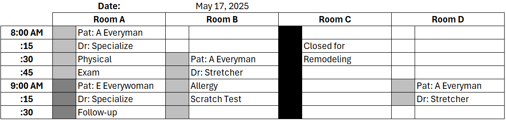
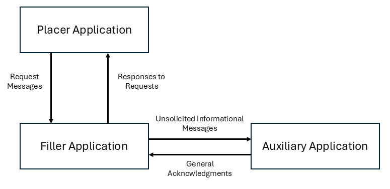

:sectnums:
:example-caption!:
// FIXME this file has example usage of captions for er7 blocks.  Do we want to keep this?  Note also the use of the doc attributes above.  Do we want those?

= Scheduling

== Introduction
[v291_section="10.2"]

This topic defines abstract messages for the purpose of communicating various events related to the scheduling of appointments (GLOSSARY) for services (GLOSSARY) or for the use of resources (GLOSSARY). There are two basic types of messages defined in this transaction set: _request transactions_ and their responses, and _unsolicited transactions_ and their responses. Request transactions communicate requests for the scheduling of appointments for services or for the use of resources. These transactions occur between _placer_ (requesting) applications (GLOSSARY) and _filler_ (processing) applications (GLOSSARY). The unsolicited transaction set provides for the exchange of scheduling information between systems with a placer application accepting unsolicited transactions issued by a filler application.

This topic describes various roles under which applications might operate. The roles discussed in this topic illustrate the underlying model used to develop this specification. They do not imply the need for a particular application model or method of implementation.

Query transactions are the messages and trigger events used between querying applications and filler applications. Previous versions of this standard included support within the sheduling topic for query transactions. Support for scheduling specific queries has been withdrawan in favor of a standardized query model as described in Chapter 5 Query. Implementers are referred to that topic for additional dietails.

== General Use Cases / Background

=== Schedules, Appointments, Services, and Resources
[v291_section="10.2.1"]

The goal of this topic is to facilitate the communication of scheduling requests and information between applications. Such communication involves three main subjects: _schedules_, _appointments_, and _services and resources_. Schedules control the occurrence of certain services and the use of particular resources. They consist of a set of open, booked (GLOSSARY) and blocked (GLOSSARY) slots (GLOSSARY) for one particular service or resource. _Open slots_ are periods of time on a schedule during which a service may occur, and/or a resource is available for use. _Booked slots_ are periods of time on a schedule that have already been reserved. _Appointments_ occupy sets of one or more booked slots on a schedule. They describe the nature of the service and/or the use of the resource, the person or persons responsible for the appointment's booking, and other information relevant to the booking and execution of an appointment. _Blocked slots_ on a schedule are periods of time during which a service or resource is unavailable for reasons other than booked appointments (for example, a piece of equipment might be unavailable for maintenance reasons).

In the context of this topic, services and resources are those things that are controlled by schedules. _Services_ are real-world events, such as clinic appointments, the performance of which is controlled by a schedule. Often, these kinds of activities relate to the care of a patient. In other words, appointments for services often schedule a service for one or more patients. _Resources_ are tangible items whose use is controlled by a schedule. These "items" are often people, locations, or things low in supply but high in demand.

==== Schedules
[v291_section="10.2.1.1"]

A _schedule_ (GLOSSARY) controls the dates and times available for the performance of a service and/or the use of a resource. One schedule applies to one service or resource, since each service or resource can be reserved independently of the others. (If two or more services, people, locations, or things cannot be reserved independently of one another, they are considered to be one activity or resource.) A schedule consists of slots of time during which the controlled service or resource is potentially available for performance or use. Slots are categorized as open, booked, or blocked. An open slot on a schedule indicates that the service or resource is available for performance or use during that period of time. A booked slot indicates that the service or resource is not available during the time period, because an appointment has been scheduled. A blocked slot indicates that a service or resource is unavailable for reasons other than a scheduled appointment.

The real-world, non-automated analog of the schedule described above is a standard appointment book. These books are generally organized with rows of time slots, during which a service or resource is available. The following figure illustrates an excerpt from such an appointment book.

Figure 1. An example excerpt from an appointment book

Each cell in the figure above represents a slot on a schedule. Different shading patterns represent booked and blocked slots. Information identifying the appointments scheduled in booked slots is written in the appointment book. Similarly, explanations are written into the book when resources are blocked. Those cells with no shading and comments represent open slots.

As in the figure above, appointment books commonly contain more than one column. This format allows the scheduling of more than one resource or activity within the same book. This topic defines a schedule as an entity controlling the availability of only one resource or service for a given period of time. Given that definition, each column in the above excerpt from the appointment book represents a separate schedule for a separate resource.

==== Services and Resources
[v291_section="10.2.1.2"]

Services and resources are the "what" in any communication of scheduling transactions, that is, they are things—either tangible or intangible—that the transaction is attempting to affect or describe. The services and resources that are controlled by schedules are typically in high demand. In any case, their use or performance is managed through the process of reserving blocks of time.

Services are typically activities that occur in a certain location, where specific people and equipment exist to carry out the activity. The activity must be scheduled prior to its occurrence. The schedule that controls the activity may not be the same schedule that controls the location, people, and equipment. For example, patient visits to a clinic are typically controlled through scheduling. Patients receive an appointment at the clinic, and at the appointed time are seen by a member of the clinic staff. From the point of view of the person or application requesting the appointment for the patient, the "thing" being scheduled is a service (e.g., a doctor's consult, an X-ray, etc.). The assignment of an exam room and (in this example) a physician, nurse practitioner, or other staff member is incidental to the actual appointment.

Resources are tangible things that must be reserved prior to their use. Examples might include MRI equipment, portable X-ray machines, or rooms. People are also tangible resources that are often scheduled. Typically these people controlled by schedules have special roles, perform special activities, and are in high demand.

The following are the primary attributes that describe a resource:

* A unique identification code +
+
The unique identification code for a service or resource describes a specific instance of that service or resource. For tangible resources, this may be a serial number, a location, an employee number, or another unique designation. For services, the identification of a slot on the schedule is usually sufficient for unique identification.

* A code describing the type of class of service or resource +
+
This code describes a type or class of service, or resource groups like services or resources together. For services, this is typically a universal service ID similar to the field used in the OBR segment defined in the Order Entry topic (Chapter 4). This Universal Service ID uniquely identifies clinical services performed in a healthcare provider organization. +
+
For tangible resources, this code may be a model number, a staff classification (such as physician, nurse, physical therapist, etc.), or a kind of room. This kind of information can be used to request a resource from a pool, where a specific instance of the resource scheduled is unknown and unimportant (as long as it is of the specified type or class).

* A name or text description of the resource +
+
The name or text description of the resource provides a human-readable identification of the service or resource.

* When a resource is associated with an appointment, or is requested for an appointment, the following attributes describe the relationship (or requested relationship):

** The start date and time the service or resource is required for the appointment. +
+
The start date and time the service or resource is required for the appointment describes the point at which the service or resource should be made available to the activity. In this specification, this is represented as a positive or negative time offset from the start date and time of the appointment.

** The duration for which the service or resource is needed for the appointment. +
+
The duration for which the service or resource is required for the appointment describes how long the service or resource is needed to complete the appointment. By adding the duration to the start date and time, the end date and time can be calculated for the required resource or service within the activity.

* Other attributes further describe services and resources. These attributes are communicated, as necessary, in transactions between applications.

==== Appointments
[v291_section="10.2.1.3"]

Appointments are instances of the performance of a service or the use of a resource. They describe the "why," the "who" and the "when" in any communication of scheduling transactions. These appointments occupy one or more slots on a service or resource schedule, causing those slots to become unavailable or "booked." Appointments can describe scheduled activities related to patients in a healthcare setting, or they can describe scheduled activities wholly unrelated to patients.

In its simplest form, an appointment consists of one service or resource reserved for a period of time, for a specific reason. More complex activities involve multiple services or resources, or parent-child relationships to other appointments.

The primary attributes for the appointment which describes a scheduled activity include the following:

* A unique placer appointment identification code +
+
The placer appointment identification code uniquely describes an instance of an appointment. It is used in communications between placer and filler applications to identify a particular appointment (or a request for an appointment booking) on the placer application. Except in special circumstances, the code is assigned by the placer application upon making an initial scheduling request. This concept is similar in practice to the placer order number found in Chapter 4, Order Entry.

* A unique filler appointment identification code +
+
The filler appointment identification code uniquely describes an instance of an appointment. It is the filler application's counter-part to the placer appointment identification code. It is used in communications between placer and filler applications to identify a particular appointment (or request for an appointment booking) on the filler application. Except under special circumstances, it is assigned by the filler application when an appointment (or a request for an appointment booking) is created by the filler application. This concept is similar in practice to the filler order number found in Chapter 4, Order Entry.

* An appointment start date and time +
+
The appointment start date and time describe the beginning of the appointment. In request transactions, the appointment start date and time are expressed as a preference or list of preferences. The filler application uses this expression of preference to book the appointment. Once an appointment has been booked, the start date and time are expressed in the actual scheduled start date and time.

* An appointment duration +
+
The appointment duration describes how long the appointment will last, and consequently, the end date and time of the appointment.

Supporting information about service and resource activities includes the following:

* Reason codes to describe the reason that the service is occurring or the resource is being used;

* Patient information to describe for whom the appointment is taking place, whether the appointment or scheduled activity is for, or related to, a patient;

* Requestor information to describe the person responsible for initiating and executing the appointment;

* Location information to describe where the appointment is scheduled to occur.

Other attributes further describe appointments. These attributes are communicated as necessary in transactions between applications.

==== Parent and Child Appointments
[v291_section="10.2.1.4"]

Parent appointments are those appointments that embody one or more child appointments. For example, a request for a repeating appointment results in a logical parent (the original scheduled appointment request), and one or more children (each individual occurrence of the appointment). This specification provides no information about how individual applications store or handle parent and child appointments, but it does provide a mechanism for identifying individual occurrences (children) within transactions.

Either the placing application or the filling application can specify child appointments—and in one of two ways. If each individual child appointment is assigned a separate and unique Placer Appointment ID and/or Filler Appointment ID, then that unique identifier may be used in transactions to specify an individual child. If, however, neither the placer nor filler application assigns a unique identifier separately, an occurrence number can be used. Both the ARQ and SCH segments allow for an occurrence number, which is a unique serial number assigned to each child within a parent appointment.

=== Application Roles
[v291_section="10.2.2"]

In this topic, there are three roles that an application can assume: a filler application role, a placer application role, and an auxiliary application role (GLOSSARY). These application roles define the interaction that an application will have with other applications in the messaging environment. In many environments, any one application may take on more than one application role.

In this specification, the definition of application roles is not intended to define or limit the functionality of specific products developed by vendors of such applications. Instead, this information is provided to help define the model used to develop this specification, and to provide an unambiguous way for applications to communicate with each other.

==== The Filler Application Role
[v291_section="10.2.2.1"]

The filler application role in the scheduling model is very similar to the filler application concept presented in Chapter 4, Order Entry. A filler application, in the scheduling model, is one that "owns" one or more schedules for one or more services or resources. In other words, a filler application exerts control over a certain set of services or resources and the schedules that define the availability of those services or resources. Because of this control, no other application has the ability to reserve, or to otherwise modify, the schedules controlled by a particular filler application.

Other applications can, on the other hand, make requests to modify the schedules owned by the filler application. The filler application either fulfills or denies requests to book slots, or to otherwise modify the schedules for the services and resources over which it exerts control.

Finally, the filler application also provides information about scheduled activities to other applications. The reasons that an application may be interested in receiving such information are varied. An application may have previously requested bookings or modifications on the schedule, or may simply be interested in the information for its own reporting or statistical purposes. The filler applications disseminates this information by issuing unsolicited information messages.

The analog of a filler application in a non-automated environment might be an appointment book and the person in charge of maintaining that book. The appointment book describes when the resources are available and when they are booked. This appointment book is the only official record of this information, and controls the availability of the resources to any user. The person in charge of this appointment book takes requests to book the resources, and decides whether to accept or reject the requests based on the information recorded in the appointment book. Anyone needing information from the appointment book either consults the book directly, or contacts the person in charge of the book.

==== The Placer Application Role
[v291_section="10.2.2.2"]

The placer application role in the scheduling model is also very similar to its counterpart in the Order Entry topic. A placer application requests the booking, modification, cancellation, etc., of a scheduled activity for a service or resource. Because it cannot exert any control over the schedule for that resource, it must send its requests to modify the schedule to the filler application. In requesting that these appointments be booked or modified in some way, the placer application is asking the filler application to exert its control over the schedule on the placer application's behalf.

The analog of a placer application in a non-automated environment might be any person needing a particular resource or appointment for a service. A person needing to book an appointment would contact the person in charge of the appointment book for that resource or service, and request a reservation. Often, there is negotiation between the person requesting the reservation or appointment and the person who maintains the appointment book. The requesting person will indicate requirements and preferences, and the person controlling the appointment book will indicate whether the request can be fulfilled as specified.

==== The Auxiliary Application Role
[v291_section="10.2.2.4"]

An auxiliary application neither exerts control over, nor requests changes to a schedule. It, too, is only concerned with gathering information about a particular schedule. It is considered an "interested third-party," in that it is interested in any changes to a particular schedule, but has no interest in changing it or controlling it in any way. An auxiliary application passively collects information by receiving unsolicited updates from a filler application.

The analog of an auxiliary application in a non-automated environment might be any person receiving reports containing schedule information. For example, a facilities manager may need to know what rooms are booked for activity during specific periods of time. This person might ask the person controlling the appointment book for a periodic listing of activity, which may be something as simple as copies of pages from the appointment book.

Often, a placer application will also act as an auxiliary application. A placer application may have the capacity to store information about the scheduled activity that it requested. In such cases, the placer application is also an "interested" application in that it wishes to receive any messages describing changes to the content or status of the scheduled activity it initiated.

==== Application Roles in a Messaging Environment
[v291_section="10.2.2.5"]

In a messaging environment, these application roles communicate using specific types of messages and trigger events. The following figure illustrates the relationships between these application roles in a messaging environment:

Figure 2. Application role messaging relationships

The relationship between placer and filler applications revolves around request messages and response messages to those requests. Placer applications trigger request messages to filler applications, which respond to those requests with request response messages.

The relationship between auxiliary and filler applications centers on unsolicited informational messages. Filler applications trigger unsolicited informational messages to auxiliary applications whenever changes in the schedule occur. Auxiliary applications do not respond with any messages other than general acknowledgments. Filler applications triggering unsolicited informational messages do not expect further information from auxiliary applications.

=== Trigger Events, Status, Reasons, and Types
[v291_section="10.2.3"]

This topic defines several trigger events used to communicate scheduling information between applications. In addition, it also defines, suggests, or allows for several statuses that scheduled activities may hold, several reasons a scheduled activity may occur, and several types of scheduled activities. The distinction between these four concepts is important for understanding the information in this topic.

==== Trigger Events
[v291_section="10.2.3.1"]

The trigger events for this topic are defined below. Traditionally, trigger events define the transition of some entity from one state to another.footnote:[HL7 trigger events are not strictly limited to this definition; however, most trigger events do define state transitions.] Typical trigger events may be listed as follows: new, cancel, modify, discontinue, reschedule, and delete.

==== Status
[v291_section="10.2.3.2"]

The status of a scheduled activity describes where that activity is in its life cycle. A status differs from a trigger event in an important way: a status describes the current condition of an entity, whereas a trigger event is generated to "move" the entity from one state to another. All status fields in this topic are defined with respect to the application acting in the role of a filler, unless otherwise (and specifically) indicated. Therefore, a status in a scheduling interface transaction is only truly meaningful if the transaction was generated by the application assigning or maintaining that status.

Typical statuses for a schedule transaction might include the following: pending, wait-listed, confirmed, canceled, discontinued, deleted, started, completed, overbooked (booked for a resource along with another conflicting appointment), blocked, etc.

==== Reasons
[v291_section="10.2.3.3"]

This topic defines two kinds of reasons used with transactions. The first is an appointment reason that indicates why the appointment is being booked – and ultimately why the activity is going to occur. The second is an event reason that describes why a particular trigger event has been generated. Reasons tend to be static, whereas statuses tend to change. In contrast, trigger events describe an action to be performed.

Appointment reasons tend to be relatively static for the life of the scheduled activity. Typical examples of appointment reasons include the following: routine, walk-in, check-up, follow-up, emergency, etc.

Event reasons are static as well, but only for the life of a particular trigger event. Typical examples of event reasons include the following: no-show (e.g., when an appointment is canceled), at patient request, at caregiver request, etc.

==== Types
[v291_section="10.2.3.4"]

Rather than describing why an appointment has been scheduled – as the appointment reason does – the appointment type describes the kind of appointment recorded in the schedule. This information tends to be administrative in nature. Typical appointment types might include: normal, tentative (or "penciled in"), STAT, etc.

=== Appointments, Orders, and Referrals
[v291_section="10.2.4"]

A schedule request or appointment should not be confused, in any way, with orders for services, or for patient referrals. The trigger events and messages defined in this topic are meant to operate within the realm of scheduling activities, and not to imply that any other trigger event or real-world event has or should occur. It should not be construed from this topic that any schedule request transaction can be used instead of an order transaction, in which a service or other activity must be specifically ordered. In such cases, a specific order transaction should occur (either electronically or otherwise). If subsequent scheduling transactions are then required to carry out the order, the trigger events and messages defined in this topic may be used.

=== Organization of Trigger Events and Message Definitions
[v291_section="10.2.6"]

This topic contains two functional groupings of trigger events and message definitions. The trigger events within each of the functional groupings share the same or similar message definitions. The notation used to describe the sequence, optionality, and repetition of segments is described in Chapter 2, "Format for defining abstract messages."

The first functional grouping of trigger events and message definitions describes _placer request transactions_. This grouping defines the trigger events and message definitions for transactions from applications acting in a placer application role, and also defines the related filler application response messages. The second functional grouping describes trigger events and message definitions for _unsolicited transactions_ from applications acting in the filler application role. This grouping describes the unsolicited messages originating from an application fulfilling the filler role, and the response messages sent back by applications fulfilling the auxiliary role. 

==== PLACER APPLICATION REQUESTS AND TRIGGER EVENTS

Placer request and filler response transactions are the messages and trigger events used between placer applications and filler applications. The placer application initiates transactions using the SRM message, requesting that the filler application modify its schedule(s) with the given trigger event and information. The filler application responds to these requests, using the SRR message, to either grant or deny the requests from the placer application. All of the trigger events associated with placer request and filler response transactions use common message definitions of SRM_S01 and SRR_S01 respectively. There are no unsolicited messages initiated from a filler application defined in this set of trigger events. Those messages and trigger events are defined below.

When initiating a request, the placer application will generate and send an SRM message containing all of the information necessary to communicate the desired action to the filler application. All required segments and fields (both explicitly required and conditionally required) should be provided to the filler application, as defined in this topic. When the filler application receives the transaction, it acknowledges it with the appropriate accept acknowledgment using an ACK message (assuming that the enhanced acknowledgment mode is in use). After processing the request at the application level, the filler acknowledges the transaction with the appropriate application acknowledgment in an SRR message (again assuming that an application acknowledgment was requested under the enhanced acknowledgment mode, or that the original acknowledgment mode is in use). Applying the explanations of the various application acknowledgment codes in the context of this topic, an application accept from the filler means that the request was processed and accepted by the filler. An application error from the filler means that the request was processed and denied. An application reject from the filler means that the request was not, and could not, be processed due to one or more reasons unrelated to its content (for example: it fails the basic application protocol validation, the filler system is down, or there was an internal error). When appropriate, an SRR message with an application accept acknowledgment will contain further information on the request that was processed.

Note that in the abstract message definitions for both the SRM and SRR, the patient information segments (segments PID through DG1) are both optional as a group, and repeating as a group. The optionality allows for transactions that relate to a patient, and for those that do not. The ability to repeat the patient information allows for those transactions in which one activity must be scheduled for multiple patients (e.g., for family or group therapy).

In contrast, a transaction may specify no more than (and no less than) one activity. Note that neither the ARQ segment (in the SRM message) nor the SCH segment (in the SRR message) are allowed to repeat, and that they are required. Neither the optionality nor the ability to repeat patient information allows a transaction to specify more than one activity.

==== FILLER APPLICATION MESSAGES AND TRIGGER EVENTS UNSOLICITED

Unsolicited transactions from filler applications are the messages and trigger events used between filler applications and auxiliary applications. Transactions are initiated by the filler application, using the SIU message to notify auxiliary applications of modifications in a filler application's schedule(s). The auxiliary application responds to these notifications, using the ACK message, either to acknowledge receipt of the transaction, or to signal that an interfacing error of some kind has occurred. All of the trigger events associated with unsolicited transactions from filler applications use a common message definition of SIU_S12.

This set of trigger events is also used to notify applications fulfilling the placer application role of changes in the filler application's schedule(s), if the application is configured to accept these messages and trigger events as an auxiliary application would. As the discussion of application roles has indicated above, any one application can have more than one application role. If it is important that the application acting in the placer application role in your messaging environment be notified of unsolicited changes to a filler application's schedule(s), then it must also support the role of an auxiliary application.

When initiating a notification transaction, the filler application will generate and send an SIU message containing all of the information necessary to communicate the desired information to the auxiliary application. All required segments and fields (both explicitly required and conditionally required) should be provided by the filler application, as defined in this topic. When the auxiliary application receives the transaction, it acknowledges with the appropriate accept acknowledgment using an ACK message (assuming that the enhanced acknowledgment mode is in use). After processing the notification at the application level, the auxiliary application acknowledges the transaction with the appropriate application acknowledgment in an ACK message (assuming that an application acknowledgment was requested under the enhanced acknowledgment mode, or that the original acknowledgment mode is in use). Applying the explanations of the various application acknowledgment codes (detailed in Chapter 2) in the context of this topic, an application accept from the auxiliary application means that the notification was processed and accepted. An application error from the auxiliary application means that the auxiliary application was unable to process the notification at the application level. An application reject from the auxiliary application means that the request was not, and could not, be processed due to one or more reasons unrelated to its content (for example: it fails the basic application protocol validation, the system is down, or there was an internal error).

== Implementation Considerations
[v291_section="10.8"]

=== Update mode
[v291_section="10.2.6.1"]

This topic uses the "Action code/unique identifier" mode for updating via repeating segments. For more information on updating via repeating segments, please see section 2.10.4, "Protocol for interpreting repeating segments or segment groups in an update Message," in Chapter 2. The definition of the "Action code/unique identifier" update mode can be found in Chapter 2, Section 2.10.4.2, "Action code/unique identifier mode update definition."

=== Logical Relationship of Resource and Service Segments
[v291_section="10.8.1"]

This topic implies that the relationship of the repeating resource and service specific segments has a logical "and" relationship. In other words, if more than one AIP segment is sent in a transaction, it is logical to assume that both specified personnel resources are required for the appointment. Currently, there is no way to specify an "or" relationship between the resource and service segments. It is possible to specify a resource type and achieve a similar (but not equivalent) effect.

=== Multiple Placer Applications
[v291_section="10.8.2"]

When implementing the transactions defined in this topic with multiple placer applications, one must consider the implications of a situation when more than one placer application asks to book, hold, lock, or otherwise reserve the same slot or set of slots on a particular schedule.

This topic makes no attempt to define attribute ownership (e.g., based on application roles). Ownership is the right to create or update attribute content. If two or more applications attempt simultaneously to update the same attribute(s), deadly update collisions may occur, causing data corruption, unless robust mechanisms for bidding and locking such attributes are in place between applications. This topic makes no attempt to address data ownership issues or to define attribute bidding and locking mechanisms.

This topic assumes that the placer and filler applications have put such mechanisms into place, therefore resolving any contention or collision issues at the application level. Further, if such mechanisms have not been implemented by the applications, then this topic assumes that procedural solutions have been implemented by the healthcare provider organization to resolve contention and collision issues.

== Technical Specs

xref:technical_specs/S01.adoc[Message - S01 Request New Appointment Booking]

xref:technical_specs/S02.adoc[Message - S02 Request Appointment Rescheduling]

xref:technical_specs/S03.adoc[Message - S03 Request Appointment Modification]

xref:technical_specs/S04.adoc[Message - S04 Request Appointment Cancellation]

xref:technical_specs/S05.adoc[Message - S05 Request Appointment Discontinuation]

xref:technical_specs/S06.adoc[Message - S06 Request Appointment Deletion]

xref:technical_specs/S07.adoc[Message - S07 Request Addition of Service/Resource on Appointment]

xref:technical_specs/S08.adoc[Message - S08 Request Modification of Service/Resource on Appointment]

xref:technical_specs/S09.adoc[Message - S09 Request Cancellation of Service/Resource on Appointment]

xref:technical_specs/S10.adoc[Message - S10 Request Discontinuation of Service/Resource on Appointment]

xref:technical_specs/S11.adoc[Message - S11 Request Deletion of Service/Resource on Appointment]

xref:technical_specs/S12.adoc[Message - S12 Notification of New Appointment Booking]

xref:technical_specs/S13.adoc[Message - S13 Notification of Appointment Rescheduling]

xref:technical_specs/S14.adoc[Message - S14 Notification of Appointment Modification]

xref:technical_specs/S15.adoc[Message - S15 Notification of Appointment Cancellation]

xref:technical_specs/S16.adoc[Message - S16 Notification of Appointment Discontinuation]

xref:technical_specs/S17.adoc[Message - S17 Notification of Appointment Deletion]

xref:technical_specs/S18.adoc[Message - S18 Notification of Addition of Service/Resource on Appointment]

xref:technical_specs/S19.adoc[Message - S19 Notification of Modification of Service/Resource on Appointment]

xref:technical_specs/S20.adoc[Message - S20 Notification of Cancellation of Service/Resource on Appointment]

xref:technical_specs/S21.adoc[Message - S21 Request Discontinuation of Service/Resource on Appointment]

xref:technical_specs/S22.adoc[Message - S22 Notification of Deletion of Service/Resource on Appointment]

xref:technical_specs/S23.adoc[Message - S23 Notification of Blocked Schedule Time Slot(s)]

xref:technical_specs/S24.adoc[Message - S24 Notification of Opened ("un-blocked") Schedule Time Slot(s)]

xref:technical_specs/S26.adoc[Message - S26 Notification That Patient Did Not Show Up for Scheduled Appointment]

xref:technical_specs/S27.adoc[Message - S27 Broadcast Notification of Scheduled Appointments]

== Example Transactions
[v291_section="10.7"]

=== Request and Receive New Appointment - Event S01
[v291_section="10.7.1"]

The patient has been seen by his primary care physician, Dr. Patricia Primary, and requires treatment by a cardiologist. The PCP requests a new appointment with Dr. Pump at the North Office. The patient has requested that the appointment be scheduled for a time between January 2nd and January 10th, 2025, and between 8:00 AM and 5:00 PM. Dr. Pump's office responds to the request with an appointment at the North Office at 9:30 AM on January 6, 2025.

[er7]
MSH|^~\&|PRIMARY|EWHIN|SPOCARD|EWHIN|202501010800||SRM^S01^SRM_S01|090849PRIMARY|P|2.8|||AL|AL
ARQ|19940047^SCH001|||||047^Referral||NORMAL|||202501020800^202501101700||||0045^Contact^Carrie^S||||3372^Person^Entered
PID|||484848^^^^MR||Everyman^Adam^A||19601121|M|Alias||2222 Home Street^Jay^WA^99021||555-2003|||M
DG1|001||786.5^^I9|CHEST PAINS|202501010730|W
DG1|002||412^I9|OLD MYOCARDIAL INFARCTION|202501010730|W
RGS|001
AIP|001||032^Pump^Patrick|002^CARDIOLOGIST|||||||NO
AIL|001|^NORTH OFFICE|002^CLINIC|||||||YES

[er7]
MSH|^~\&|PRIMARY|EWHIN|JONES|EWHIN|202501010802||ACK|021244SPOCARD|P|2.8
MSA|CA|090849JONES

[er7]
MSH|^~\&|PRIMARY|EWHIN|JONES|EWHIN|202501010810||SRR^S01^SRR_S01|0934849SPOCARD|P|2.8
MSA|AA|090849EVERYMAN
SCH|2025047^SCH001|2025567^SCH100|||||047^Referral|NORMAL||||0045^Contact^Carrie^C|555-2010|||087^By^Entered|555-2011||||BOOKED
TQ1||||||30^M|202501060930|202501061000
PID|||484848^^^^MR||Everyman^Adam^A||19601121|M|Alias||2222 Home Street^Jay^WA^99021||555-2003|||M
RGS|001
AIP|001|032^Pump^Patrick|002^CARDIOLOGIST|||||||NO|BOOKED
AIL|001|103^NORTH OFFICE|002^CLINIC|||||||NO|BOOKED

[er7]
MSH|^~\&|PRIMARY|EWHIN|SPOCARD|EWHIN|202501010812||ACK|434532JONES|P|2.8
MSA|CA|0934849SPOCARD

=== Unsolicited Notification of Rescheduled Appointment - Event S13
[v291_section="10.7.2"]

The patient has asked Dr. Pump to reschedule his January 6th appointment. Dr. Primary’s scheduling application (the filler application) sends the PCP, Dr. Primary, a notification that the original appointment has been rescheduled, followed by a notification of the new appointment on January 9th at 1:00 PM..

[er7]
MSH|^~\&|PRIMARY|EWHIN|JONES|EWHIN|202501040800||SIU^S13^SIU_S12|021244SPOCARD|P|2.8|||AL|ER
SCH|2025047^SCH001|2025567^SCH100|||||047^Referral|NORMAL||||0045^Contact^Carrie^C^^^|555-2010|||087^By^Entered^^^^|555-2011||||BOOKED
TQ1||||||30^M|202501091300|202501091330
NTE||The patient is going to be on vacation so cannot make previous appointment scheduled on January 6.
PID|||484848^^^^MR||Everyman^Adam^A||19601121|M|Alias||2222 Home Street^Jay^WA^99021||555-2003|||M
RGS|001
AIP|001|032^Pump^Patrick|002^CARDIOLOGIST|||||||NO|BOOKED
AIL|001|103^NORTH OFFICE|002^CLINIC|||||||NO|BOOKED

[er7]
MSH|^~\&|PRIMARY|EWHIN|SPOCARD|EWHIN|202501010802||ACK|035324PRIMARY|P|2.8
MSA|CA|021244SPOCARD

=== Request and Receive New Appointment with Repeating Interval - Event S01
[v291_section="10.7.3"]

The patient has been seen by his specialist, Dr. Specialize, and requires treatment by a physical therapist, Seth Stretcher. Dr. Specialize's office requests a one-hour appointment each day for the next five days. Mr. Stretcher's office responds to the request with an appointment at 9:30 AM on June 20th through June 24th, 2025.

.Request
[er7]
MSH|^~\&|SPECIALIZE|EWHIN|STRETCHER|EWHIN|202506190800||SRM^S01^SRM_S01|03432SPECIALIZE|P|2.8|||AL|AL
ARQ|20250347^SCH001|||||047^Referral||NORMAL|060|min|202506200930||Q1D|D5|00335^Specialize^Sara^S^^^MD||||A3423^Person^Entered
PID|||484848^^^^MR||Everyman^Adam^A||19401121|M|Alias||2222 Home Street^Jay^WA^99021||555-2003|||M
DG1|001||833.00^^I9|Closed dislocation wrist|202506190700
RGS|001
AIP|001|064^STRETCHER^SETH|097^PHYSICAL THERAPIST|||||||NO
AIL|001|103^NORTH OFFICE|002^CLINIC|||||||NO

.ACK
[er7]
MSH|^~\&|SPECIALIZE|EWHIN|SMITH|EWHIN|202506190802||ACK|546644STRETCHER|P|2.8
MSA|CA|03432SPECIALIZE

.Response
[er7]
MSH|^~\&|STRETCHER|EWHIN|SPECIALIZE|EWHIN|202506190810||SRR^S01^SRR_S01|0654544JONES|P|2.8
MSA|AA|03432SSPECIALIZE
SCH|2025037^SCH001|2025297^SCH100|||||047^Referral|NORMAL|| ||0335^Contact^Carrie^C^^^||||064^By^Entered|||||BOOKED
TQ1|||Q1D||5^D|60^M|202506200930|202506240930
PID|||484848^^^^MR||Everyman^Adam^A||19401121|M|Alias||2222 Home Street^Jay^WA^99021||555-2003|||M
RGS|001
AIP|001|064^STRETCHER^SETH|097^PHYSICAL THERAPIST|||||||NO|BOOKED
AIL|001|103^NORTH OFFICE|002^CLINIC|||||||NO|BOOKED

.ACK
[er7]
MSH|^~\&|SPECIALIZE|EWHIN|STRETCHER|EWHIN|202506190800||ACK|045742SPECIALIZE|P|2.8
MSA|CA|0654544JONES
