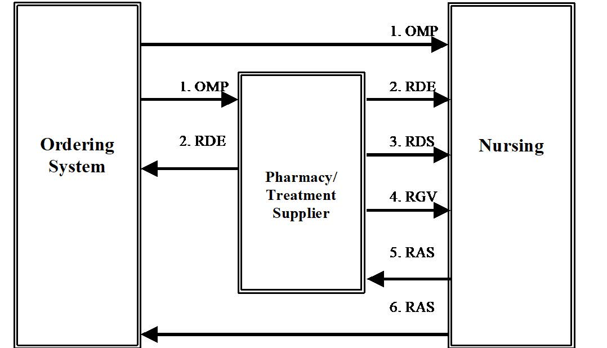

= Pharmacy

== Introduction
[v291_section="4A.3"]

== General Use Cases / Background
[v291_section="4A.6+"]

.Pharmacy/Treatment Transaction Flow Diagram

The following are possible routes at a generic site.

=== OMP:

The Ordering application generates a pharmacy/treatment OMP and sends it to the pharmacy or treatment application, Nursing application, and/or other applications as appropriate at the site.

=== RDE:

The pharmacy/treatment application may send the RDE, the Pharmacy/Treatment Encoded Order message, a fully encoded order to the Nursing application, Ordering application, and/or other system applications as appropriate at the site.

== RDS:

The pharmacy/treatment application may send the RDS, the Pharmacy/Treatment Dispense message, to the Nursing application or other applications as appropriate at the site, each time a medication is dispensed for this order. This message may occur multiple times for each order.

=== RGV:

The pharmacy application may send the RGV, the Pharmacy/Treatment Give message, to the Nursing application or other applications as appropriate at the site, for each scheduled date/time of administration of a medication for a given order. This message may occur multiple times for each order.

=== RAS:

The Nursing application (and other applications) can generate the RAS, the pharmacy/treatment Administration Results message, whenever a medication is given to the patient. This message may occur multiple times for each order.

NOTE: Sites having a long term clinical data repository may wish to route data to the data repository from copies of all or any of the five messages.

== Technical Specs

xref:technical_specs/O09.adoc[Message - O09 Pharmacy/Treatment Order]

xref:technical_specs/O11.adoc[Message - O11 Pharmacy/Treatment EncodedOrder]

xref:technical_specs/O49.adoc[Message - O49 Pharmacy/Treatment Dispense Request]

xref:technical_specs/O13.adoc[Message - O13 Pharmacy/Treatment Dispense]

xref:technical_specs/O59.adoc[Message - O59 Pharmacy/Treatment Dispense Receipt]

xref:technical_specs/O15.adoc[Message - O15 Pharmacy/Treatment Give Instructions]

xref:technical_specs/O17.adoc[Message - O17 Pharmacy/Treatment Administration]

xref:technical_specs/O25.adoc[Message - O25 Pharmacy/Treatment Refill Authorization Request]

xref:technical_specs/Q11_K31.adoc.adoc[Message - Q11/K31 Pharmacy Query/Response]
