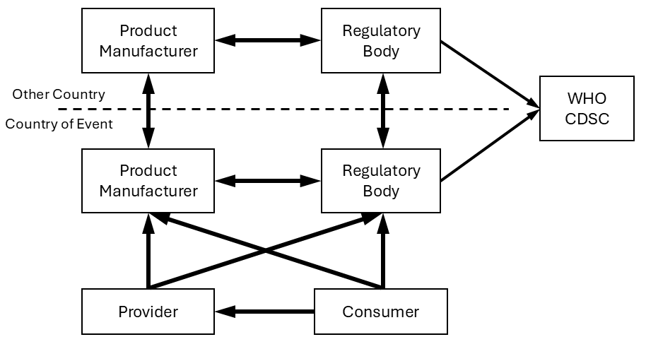

== Product Experience

== Introduction
[v291_section="7.10"]

Patients experience symptoms, manifest signs or develop diseases or syndromes while exposed to medical devices (GLOSSARY) and/or drugs (GLOSSARY). Evidence suggests that some of these symptoms, signs, diseases or syndromes may develop as a consequence of the products (GLOSSARY) used. Examples include the development of clear cell adenocarcinoma of the vagina in the daughters of mothers treated with diethylstilbestrol during pregnancy and gastrointestinal bleeding in patients treated with non-steroidal anti-inflammatory drugs. While it is difficult to prove causality (GLOSSARY), strong evidence exists in many cases.

It is important to document such experiences during the development and testing of products to identify potential adverse effects (GLOSSARY) but also during routine use of the product to identify serious adverse effects which occur infrequently. The latter is the realm of pharmacoepidemiology and post-marketing surveillance.

Adverse events are important for product manufacturers (GLOSSARY) as signal generating hypotheses concerning drug kinetics or dynamics, often in special populations of patients. Adverse events are important for regulators in ensuring that manufacturers protect the public health in assessments of risk and benefits, including special populations, and that they promptly and thoroughly investigate individual events and clusters of events. Adverse events are especially important for practitioners and patients who always deal with a special population of one individual who may be having an event and a practitioner seeking information about related events seen with the same or similar products.

Reporting has usually focused on _serious_ and _unexpected_ events. Serious (GLOSSARY), if defined unambiguously, focuses attention on those events of most importance to the patient and practitioner. Expected events (GLOSSARY) are those which prior experience has demonstrated to be probabilistically linked to the product and are generally included in product labeling.

Because of the risks associated with the uses of drugs and medical devices, a system of surveillance has been established in most developed countries. With globalization of the marketplace, the need to share this information across national boundaries has increased. Currently most reporting is performed using a series of forms, including CIOMS, yellow cards, the FDA's 1639 and MedWatch forms and the Japanese form, which are sent:

• from identified reporting sources to regulatory agencies (GLOSSARY)

• from identified reporting sources to product manufacturers

• between regulatory agencies

• within product manufacturers

• within regulatory agencies

• from product manufacturers to regulatory agencies

• from regulatory agencies to the WHO Collaborative Drug Surveillance Center (CDSC)

Figure 1. - Flow of product experience information

Regardless of who originates a drug experience report, documentation of the experience eventually reaches the regulatory agencies. The manufacturer is mandated to alert the regulatory agency.

Electronic interchange of these data would reduce errors, decrease costs and speed communications.

=== References
[v291_section="7.10.2"]

Gabrielli ER. Standard specification for drug therapy documentation. ASTM Committee E31.12 July (1993).

Kessler DA. Introducing MEDWatch. JAMA 269: 2765-2768(1993).

Kurata JH, Overhage JM, Gabrielli E, Jones JK. International Data Standards for Hospital-based Drug Surveillance. M.D. Computing 12(1) 50-57 (1995).

Moore N, Montera d, Coulson R, DeAbajo F, Kreft-Jais C, Biron A, Monteaugudo J. The single case format: proposal for a structured message for the telematic transmission of information on individual case reports in pharmacovigilance. Pharmacoepidemiology and Drug Safety 3: 157-162 (1994)

Thompson WL. A modest proposal for enhancing the safety and effectiveness of use of human drugs, biologics and devices and animal health products with human health implications through cost-effective health informatics tools supporting a global database of safety reports as a joint ICH E2, M1 and M2 initiative. Private communication. March (1995)

== Technical Specs

xref:technical_specs/P07.adoc[Message - P07 Unsolicited initial individual product experience report]

xref:technical_specs/P08.adoc[Message - P08 Unsolicited update individual product experience report]

== Examples

=== Unsolicited initial individual product experience report - Event P07
[v291_section="7.13"]

[er7]
MSH|^-&|SAP||RAP||202506051512||PEX^P07^PEX_P07|...
EVN|...
PID|1||||A^A^A||19630616|F|||||||||||||||||Y|...
PES|MakeADrug, Inc||Manufacturer Mall^^Ann Arbor^MI^99999|| GB95070448A|0|||20250704|20250710|10D|...
PEO||^Awaiting results of autopsy|20250704||||^^^^^GBR||S|N|D~H~O||Patient admitted via casualty with increased shortness of breath and left sided chest pain on 04-JUL-2025 for assessment.~11-JUL-2025 Patient admitted 09-JUL-2025 at 11:30 PM with an 18 hour history of diarrhea followed by collapse. On admission, patient was exhausted and dehydrated. She had a rash on both breasts and abdomen. Patient found to have deteriorating renal function. Patient commenced IV fluid, however patient was found dead on 10-JUL-2025 morning. Query vomited and aspirated. Post mortem requested. Events possibly related to study drug.|...
PCR|xxxxx^Wonder Drug 1^ATC|N|^antineoplastic|||||||^NON SMALL CELL LUNG CANCER|...
RXE|1^^^20250629^20250710|xxxxx^Wonder Drug 1^ATC|1||TAB|||||||||||||||||M1|3||||NON SMALL CELL LUNG CANCER|...
RXR|PO|...
PRB|AD|202550704|705^DYSPNEA^MEDR|...
PRB|AD|20250710|20143^DEATH^MEDR|...
PRB|AD|20250704|18330^CHEST PAIN^MEDR|...
PRB|AD|20250709|21197^DIARRHEA^MEDR|...
PRB|AD|20250709|6432^SYNCOPE^MEDR|...
PRB|AD|20250709|4966^DEHYDRATION^MEDR|...
PRB|AD|20250709|20544^KIDNEY FUNCTION ABNORMAL^MEDR|...
OBX|1|NM|804-5^lEUKOCYTES^LN||2300|10*3/ml|||||F|20250704|...
OBX|2|NM|770-8^NEUTROPHILS/100 LEUKOCYTES^LN||1.9|%|||||F|20250704|...
OBX|3|NM|6299-2^UREA NITROGEN^LN||22.3|mg%|||||F|20250709|...
OBX|4|NM|2160-0^CREATININE^LN||247|mmole|||||F|20250709|...
NTE|||Additional details must be obtained from the affiliate in order to assess causality. A three day alert phone call was made to the FDA on 12-JUL-2025|...
