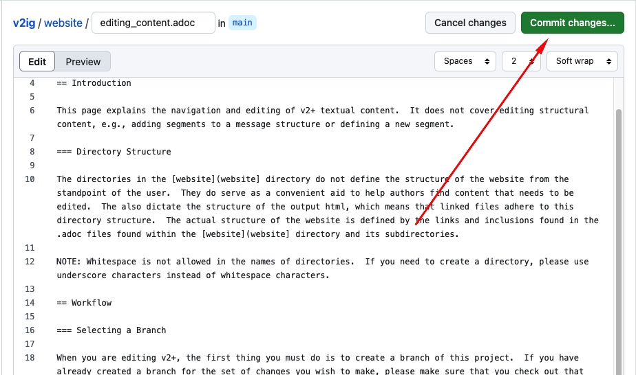

= Editing v2+ Content
:toc:

== TODO

Write something the lets people know that the metadata about v291 origins is ultimately inconsequential

== Introduction

This page explains the navigation and editing of v2+ textual content.  It does not cover editing structural content, e.g., adding segments to a message structure or defining a new segment.

=== Directory Structure

The directories in the xref:.[website directory] do not define the structure of the website from the standpoint of the user.  They do serve as a convenient aid to help authors find content that needs to be edited.  The also dictate the structure of the output html, which means that linked files adhere to this directory structure.  The actual structure of the website is defined by the links and inclusions found in the .adoc files found within the xref:.[website directory] and its subdirectories. 

NOTE: Whitespace is not allowed in the names of directories.  If you need to create a directory, please use underscore characters instead of whitespace characters.

== Workflow

=== Selecting a Branch

When you are editing v2+, the first thing you must do is to create a branch of this project.  If you have already created a branch for the set of changes you wish to make, please make sure that you check out that branch before continuing to make any changes.  It is *important* that you familiarize yourself with the instructions found on the xref:branch_management.adoc[Using Git Branches While Editing v2+] page.

=== Editing Content

GitHub includes an editor that may be used to edit files online.

==== Editing Files Directly in The Online GitHub Repository

GitHub includes an easy-to-use editor right in the GitHub web application.  For information about using the tool please visit GitHub's documentation https://docs.github.com/en/codespaces/the-githubdev-web-based-editor[here].

TODO

==== Using the github.dev web-based editor (VS Code)

You have the option of using the GitHub's online VS Code IDE for editing v2+ content.  Using this editor will have steeper learning curve for those unfamiliar with VS Code.  Some of the advantages of using this tool are the ability to group changes across multiple files into a single commit and the ability to see a near-realtime rendering of AsciiDoc beside your editing window.  For more information about the github.dev web-based editor, please see the https://docs.github.com/en/codespaces/the-githubdev-web-based-editor[GitHub documentation].

TODO - add further documentation

==== Using AsciiDoc with v2+

Please visit the [using_asciidoc.adoc](Using AsciiDoc with v2+) page.

=== Saving Changes

[IMPORTANT]
Whenever you make changes to any file, you [red]*MUST* commit your changes in order for them to be saved.

To commit your changes when using the basic, built-in editor, find the `Commit` button in the upper right of the window and click it.  Follow the directions shown in the images below.  Make sure to enter sufficiently descriptive information about the commit.  The commit message may include information that describes what you did, why you did it, what work still remains to be done, a reference to a Jira ticket, or whatever you deem appropriate.

.Click Commit Button

.Add Commit Message and Complete Commit
image:commit_finish.png[]

